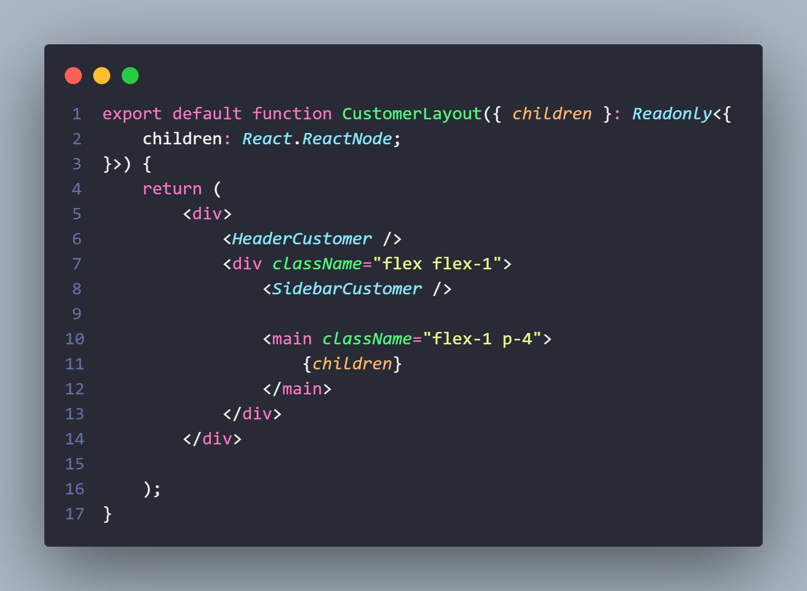
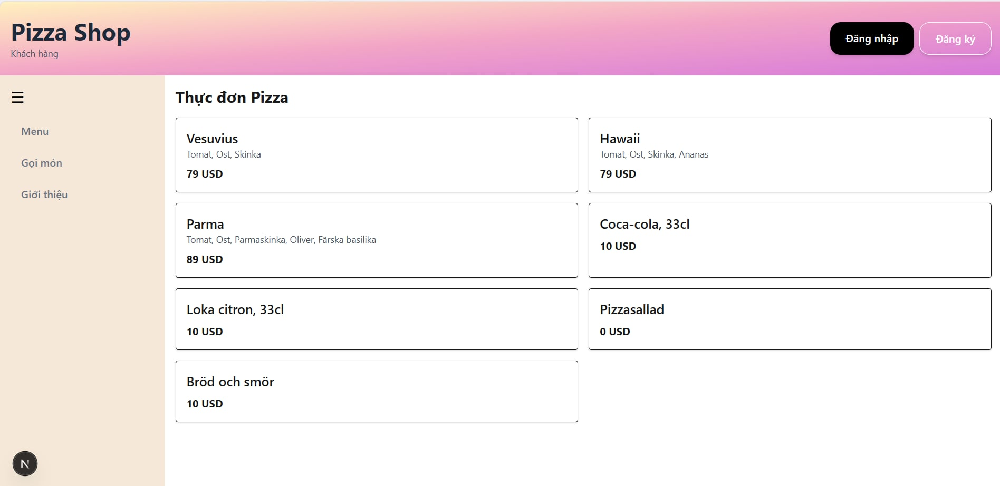
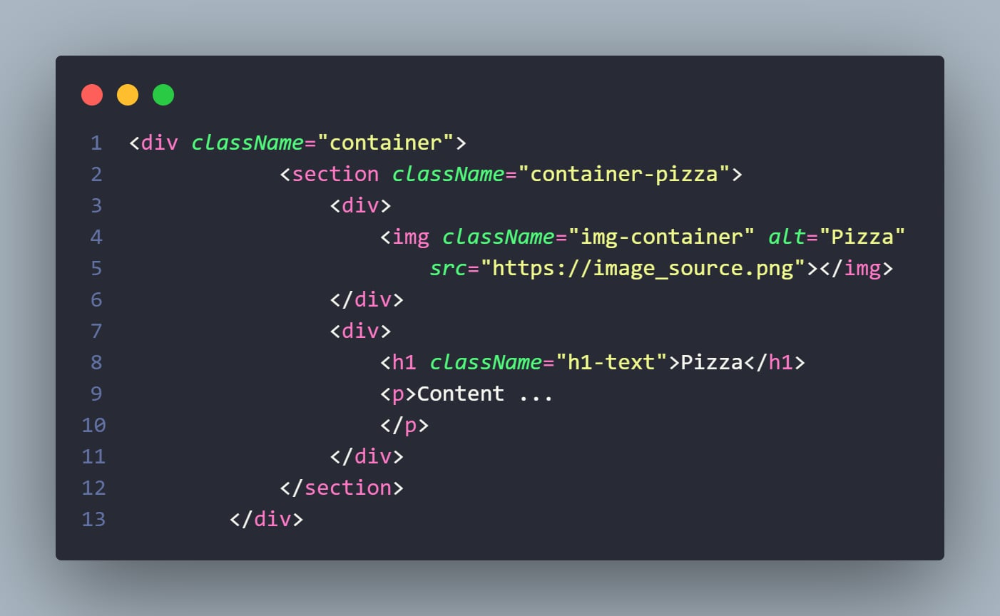
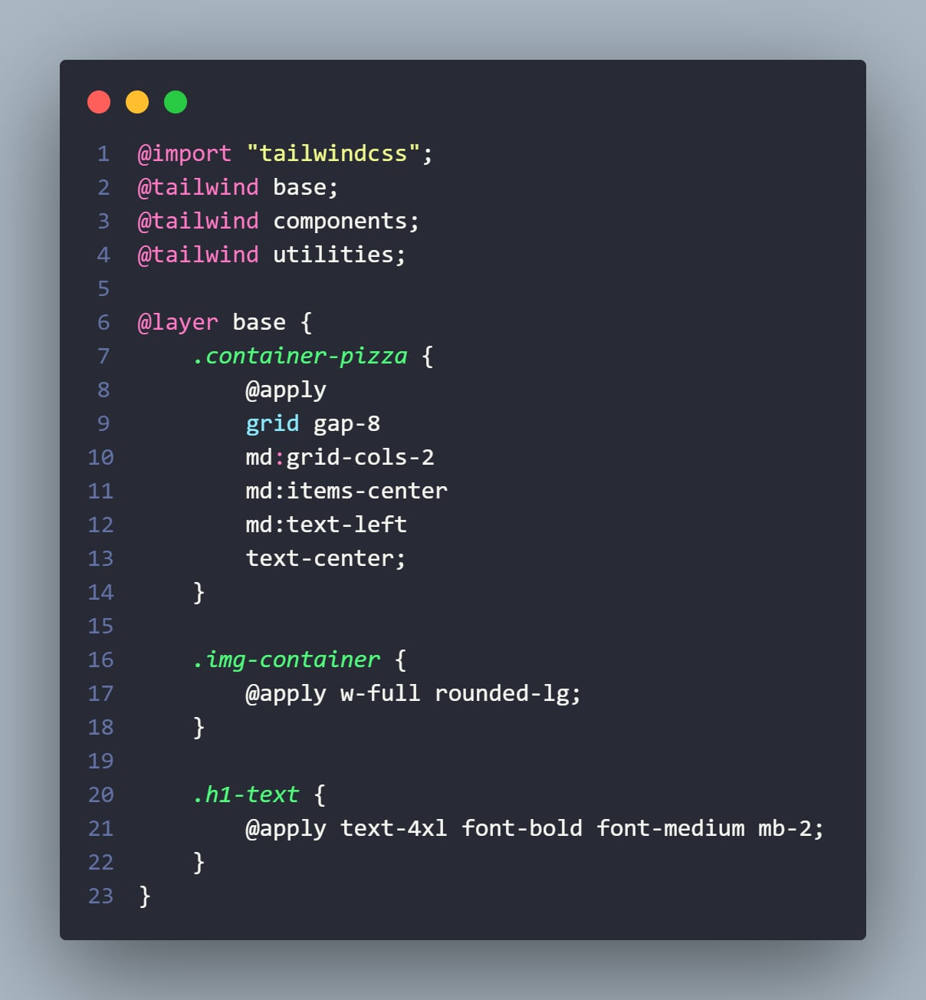

# Wrapper Layout Next JS

## Layout

Layout is UI shared between multiple pages

Layout contains children property, which nextjs populate the page content

A wrapper layout is like a reusable page template that wraps your content with shared components like a Header and Sidebar. It helps keep your site layout consistent on every page.

## Usage

### 🧩 Layout Structure
This layout includes three parts:

1. Header – A bar at the top with the title and login/logout buttons

2. Sidebar – A vertical menu on the left side

3. Children – The main content in the center (this part changes based on the page)

<!--  -->
```tsx
<div>
  <HeaderCustomer /> {/* Top bar with title and login/logout */}

  <div className="flex flex-1">
    <SidebarCustomer /> {/* Left sidebar navigation */}

    <main className="flex-1 p-4">
      {children} {/* This is where the page-specific content shows up */}
    </main>
  </div>
</div>
```

### 💡 Visual Result

Here’s what this layout looks like when it’s rendered:

- Header: A horizontal pink gradient bar at the top with your website title and Login/Logout buttons.

- Sidebar: A vertical pastel-colored menu on the left side.

- Main Content (Children): The center area, where dynamic content like the Pizza Menu appears.




### Complete code


# Responsive Tailwind CSS

Tailwind uses mobile first breakpoint system. That is create mobile design, and adapt it to larger screen sizes by using breakpoints.

By default, Tailwind have 5 breakpoints: sm, md, lg, xl, 2xl

| Breakpoint prefix            | Minimum width             | CSS |
|----------------------------|----------------------------|----------|
| sm                     | 40rem (640px)          | @media (width >= 40rem) { ... }     |
| md                     | 48rem (768px)          | @media (width >= 48rem) { ... }     |
| lg                     | 64rem (1024px)         | @media (width >= 64rem) { ... }     |
| xl                     | 80rem (1280px)         | @media (width >= 80rem) { ... }     |
| 2xl                    | 96rem (1536px)         | @media (width >= 96rem) { ... }     |

For example

```
font-light
```
By default, this css can be applied to all screen width

```
md:font-bold
```
When adding this css line, only activated when the screen is medium (≥768px) or larger

```css
.decorative-text {
    @apply md:font-bold font-light;
}
```
When putting them together, normally the text should be in light font. Whenever the screen width is ≥768px or larger, the font text should be in bold
font.

## Usage

### 🛠 Importing CSS File
Firstly, import css file in the .tsx page

```tsx
import '@/styles/css/customer/pizza.css';
```

### 🧱 Add the Class to TSX file
At page file, call css class as normal

```html
<div className="container-pizza">
    <!-- Your content here -->
</div>
```

### 🎨 Setup Tailwind

In css file, import Tailwind library

```css
@import "tailwindcss";
@tailwind base;
@tailwind components;
@tailwind utilities;
```

### ✨ Define Custom Style with Tailwind Utilities
Create your own class using Tailwind’s utility classes. Do this inside the @layer base block.

```css
@layer base {
    .container-pizza {
        @apply grid gap-8 md:grid-cols-2 md:items-center md:text-left text-center;
    }
}
```

#### 🧠 What Does This Mean?
- @layer base: This is where you define basic global styles.

- .container-pizza: This is your custom class name.

- @apply: This lets you use Tailwind classes inside your custom class.

#### 💡 How Responsive Works Here
- grid gap-8: Always use a grid layout with spacing between items.

- text-center: Text is centered on small screens (default).

- md:grid-cols-2, md:items-center, md:text-left: These only activate when the screen is medium (≥768px) or larger.


### Complete code



