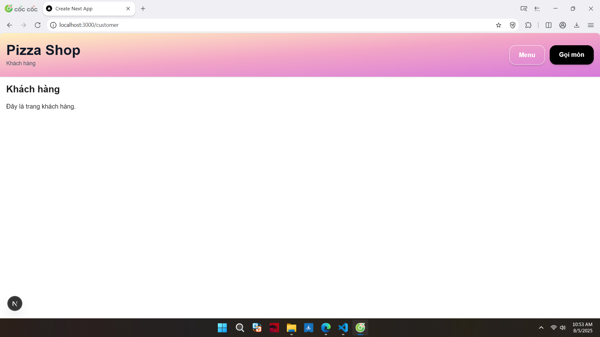
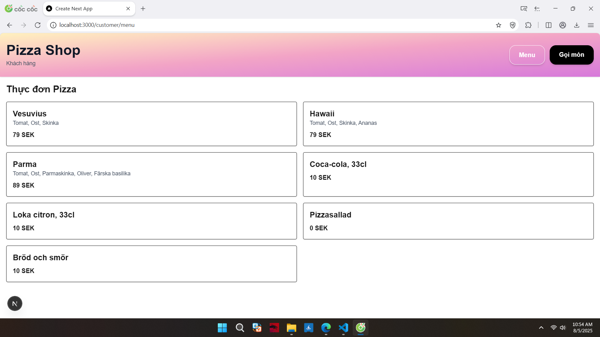
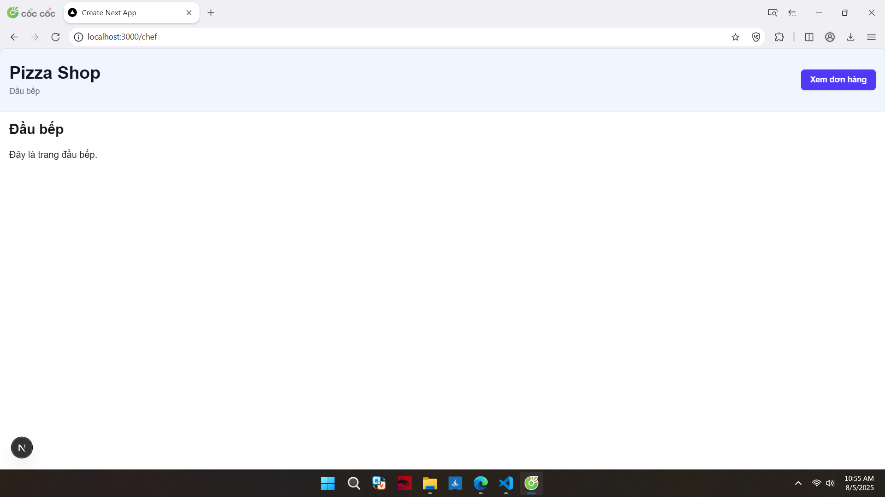
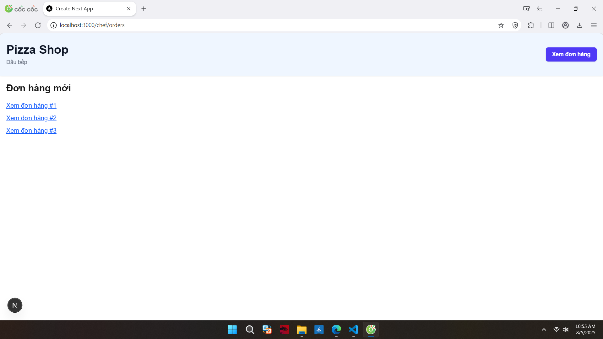
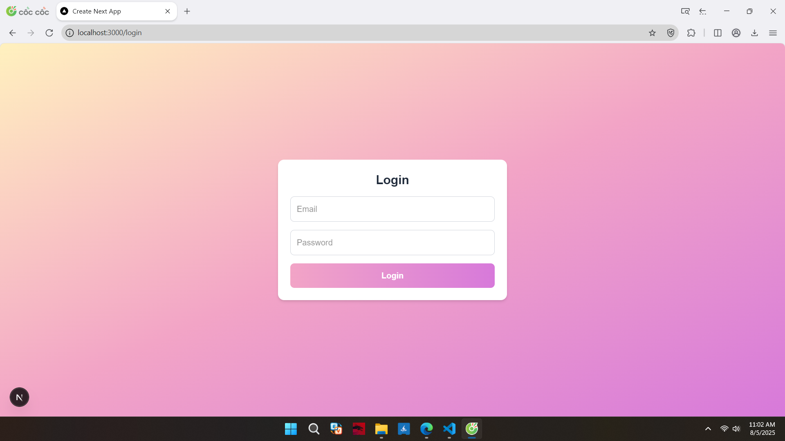
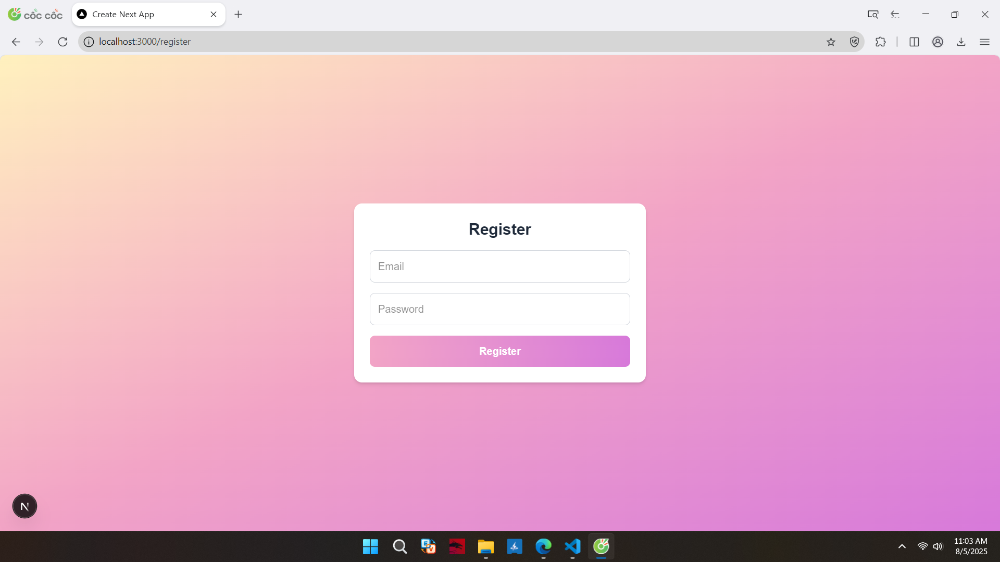
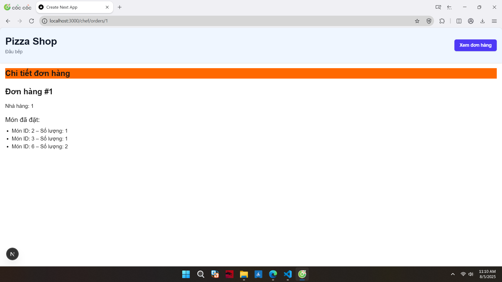
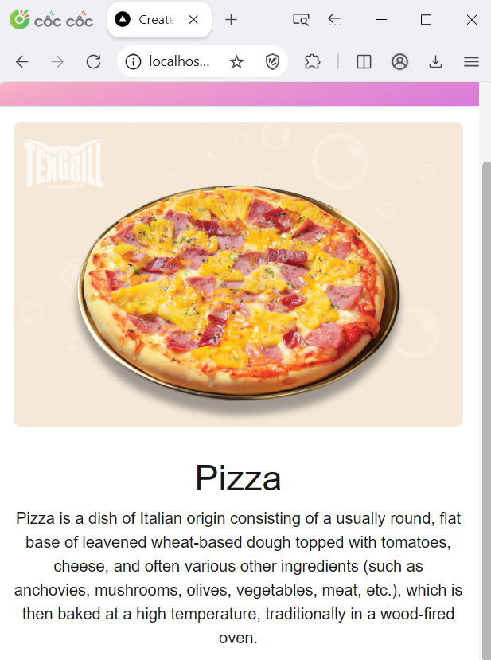
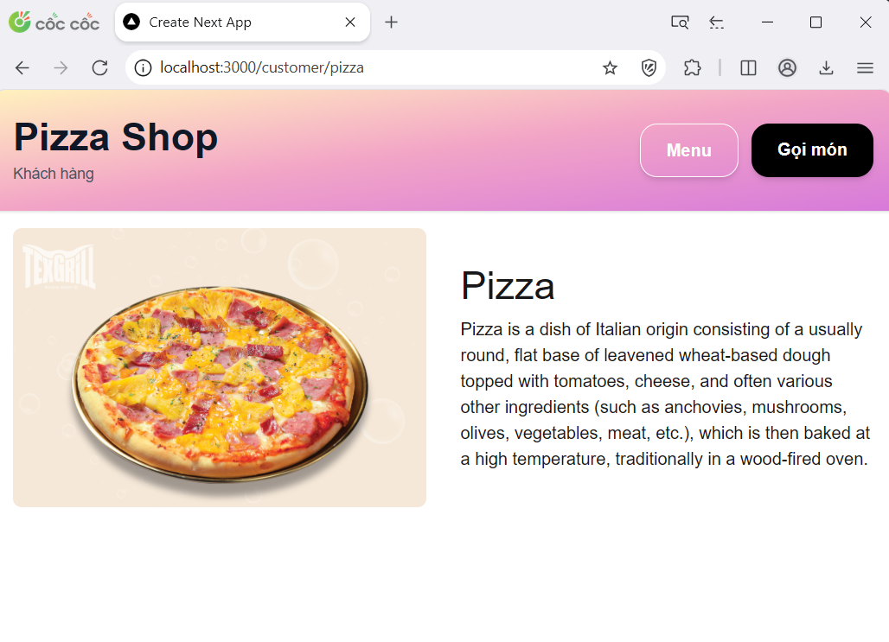

# Layout Next JS

## Layout

Layout is UI shared between multiple pages

Layout contains children property, which nextjs populate the page content

For example: 

### Customer layout

Customer page and menu page shared the same layout - colorful header

### Chef layout

Chef page and chef order page shared the same layout - light blue header

## Multiple layout

Nextjs supports multiple layout. Beside header layout using in Customer and Chef, login page and register page shared the same layout, which is color gradient background

## Nested layout

Layout in NextJs can be nested

For example in Chef order details page. Beside chef header layout, each page shared the same line "Chi tiết đơn hàng"

# Responsive Tailwind CSS

Tailwind uses mobile first breakpoint system. That is create mobile design, and adapt it to larger screen sizes by using breakpoints.

By default, Tailwind have 5 breakpoints: sm, md, lg, xl, 2xl

| Breakpoint prefix            | Minimum width             | CSS |
|----------------------------|----------------------------|----------|
| sm                     | 40rem (640px)          | @media (width >= 40rem) { ... }     |
| md                     | 48rem (768px)          | @media (width >= 48rem) { ... }     |
| lg                     | 64rem (1024px)         | @media (width >= 64rem) { ... }     |
| xl                     | 80rem (1280px)         | @media (width >= 80rem) { ... }     |
| 2xl                    | 96rem (1536px)         | @media (width >= 96rem) { ... }     |

For example

Normally, in mobile size view, the image of pizza loaded first and placed above paragraph (image 1). When stretching the window size, the image turning bigger and the paragragh re-align to fit the size page. Keep stretching until the size page meet breakpoint (here is md - medium - 768px), the image and paragragh align in same line because of the activation of breakpoint prefix.

